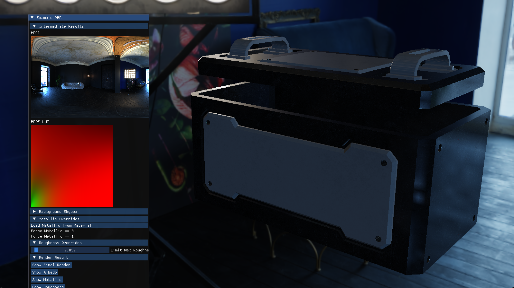

# Vise

Vise is a lightweight Vulkan abstraction with OpenGL compatability.
This abstraction allows developers to optimize the application against Vulkan while
enjoying full compatability with OpenGL.

Do not use Vise if your application:
- only needs to support Vulkan
- only needs to support OpenGL
- needs to support more than Vulkan and OpenGL

This abstraction targets exactly the two graphics API by Khronos.

## Eary WIP

Early work in progress, most Vulkan performance features will be preserved (emulated on OpenGL).

Abstractions across both backends:
- GLFW window support. `DONE`
- Frames in Flight / Frame Concurrency. `DONE`
- Pipeline Set Bindings.
	- Combined Image Sampler `DONE`
	- Uniform Buffer `DONE`
	- Storage Buffer `DONE`
	- Stroage Image `DONE`
- Pipeline Push Constants. `TODO`
- Indirect Draw `TODO`
- Offline Compilation of Vise GLSL shaders. `TODO`
- Multithreaded Command Buffer Recording. `TODO`

To build examples manually:

```
git clone https://github.com/x2w-soda/Vise.git
cd Vise
git submodule init
git submodule update
mkdir Build && cd Build
cmake ../
```

Remember to update submodules, the binary assets are stored in another repository with git LFS.

On windows, `Built.bat` will build the examples and tests.

## Screenshots

Screenshots from example applications.



PBR Example, with Image Based Lighting.

## Credits

Vise is not possible without the following libraries.

| Library     | Usage                    | License    |
| ----------- | ------------------------ | ---------- |
| Glad        | OpenGL Loader            | MIT        |
| Volk        | Vulkan Loader            | MIT        |
| VMA         | Vulkan Memory Allocation | MIT        |
| SPIRV cross | Vise GLSL Compilation    | Apache 2.0 |
| glslang     | Vise GLSL Compilation    | multiple*  |

glslang is covered by [multiple](https://github.com/KhronosGroup/glslang/blob/main/LICENSE.txt)
licenses at each release.

## License

This library is distrubuted under the permissive MIT License.